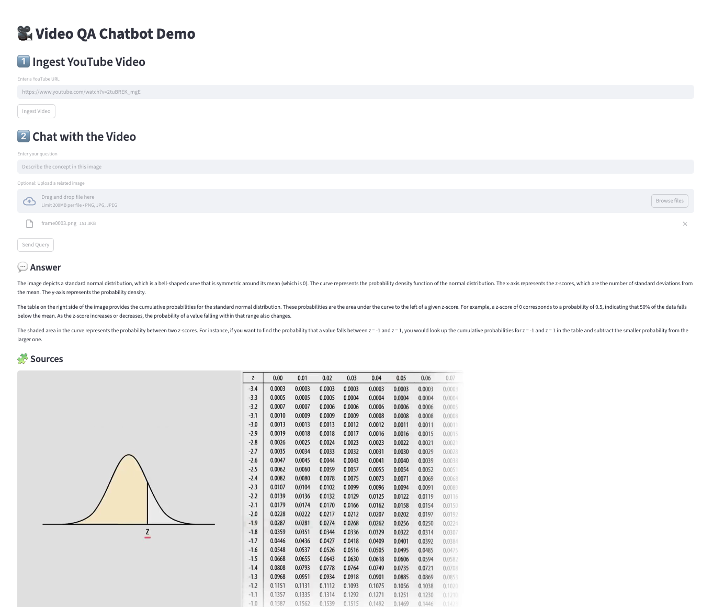

# 🎥 AskYouTube

**Multimodal Chatbot for YouTube Videos — Summarize, Search, and Query with Text and Images**

---

## 🚀 Overview

**AskYouTube** is a multimodal chatbot that enables **interactive question-answering and summarization** over YouTube videos.

Given a YouTube URL, the system automatically:

1. **Extracts** the transcript and representative video frames (with timestamps).
2. **Indexes** both modalities (text + images) into a **vector database** for multimodal retrieval.
3. **Generates responses** using a **multimodal language model (LLM)** that reasons over the retrieved video content.

In short — you ask questions, and the system understands **what’s said** _and_ **what’s shown** in the video to deliver grounded, context-aware answers.

---

## 🔍 Key Features

- 🎬 **YouTube Video Ingestion** — process any video directly from its URL
- 🗣️ **Accurate Transcription** via [OpenAI Whisper](https://github.com/openai/whisper)
- 🖼️ **Frame Extraction** with timestamp alignment
- 🧩 **Multimodal Vector Indexing** — store both transcript chunks and visual frames using [OpenAI CLIP](https://github.com/openai/CLIP)
- 💬 **Multimodal LLM Inference** — accepts text or text + image queries and answers with grounded reasoning, powered by [Ollama](https://ollama.com/)
- 🧾 **Video Summarization** — generate concise summaries of video content
- 🐳 **Dockerized Deployment** — easy to set up and run anywhere

---

## ✅ Getting Started

<p align="center">
  
</p>

### 🧱 Prerequisites

- Docker
- NVIDIA Container Toolkit
- GPU with **≥ 12 GB VRAM** (for local LLM hosting)

### 📦 Installation

```bash
git clone https://github.com/tien02/askyoutube.git
cp container/.env-example container/.env
```

### ▶️ Run with Docker

```bash
bash scripts/dev.sh
```

---

## 💡 Usage

1. Start the service (via Docker or directly in Python).
2. Provide a YouTube URL through the UI or API.
3. Wait for transcript and frame indexing to complete.
4. Ask a question (text or text + image).
5. Receive an answer generated by the multimodal LLM.

Try the demo with:

```
pip install streamlit
streamlit run app.py
```

---

## 🧠 Configuration

You can configure the system through environment variables or a `.env` file:

- `LLM_MODEL` — model name or endpoint
- `IMAGE_ENCODER` — encoder model name or endpoint
- `VECTOR_DB_URL` — connection details for vector storage
- `FRAME_INTERVAL` — frame extraction interval (in seconds)

---

## 🧩 Project Structure

```
.
├── app/                     # Main entry point (API + service logic)
├── container/               # Environment & deployment files
├── scripts/                 # Ingestion, preprocessing, and helper scripts
├── test/                    # Test suite
├── Dockerfile               # Container definition
├── requirements.txt         # Python dependencies
└── assets/                  # Example images / demos
```

---

## 🧪 Testing

You can test individual modules using the scripts in the `test/` directory:

```bash
# Test YouTube ingestion and indexing
python test/test_ingest.py <youtube_url>

# Test multimodal chat with text and image query
python test/test_chat.py <video_id> <question> <local_image_path>
```

---

## ⚠️ Limitations & Future Work

- ⏱️ **Long Videos** — may produce large vector indexes and slower retrieval; segmentation or hierarchical indexing planned.
- 🖼️ **Frame Sampling** — may miss key visuals if extracted too sparsely; scene-change detection under development.
- 🧮 **Context Limits** — large context may exceed model input size; improved ranking and pruning planned.
- 🔤 **Additional Modalities** — future support for audio embeddings, motion cues, and OCR from frames.
- 📡 **Streaming Support** — real-time streaming and incremental summarization are in progress.
